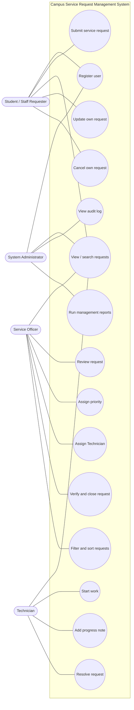
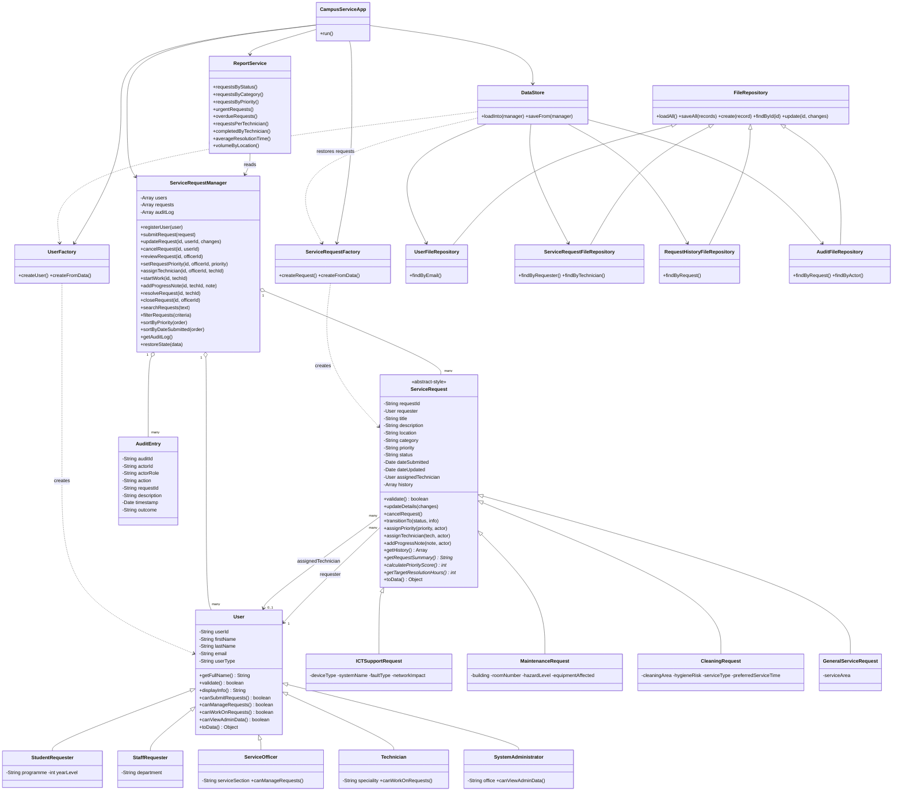
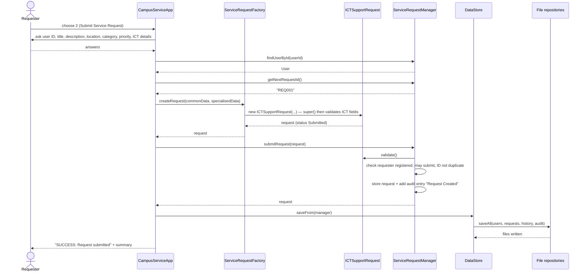
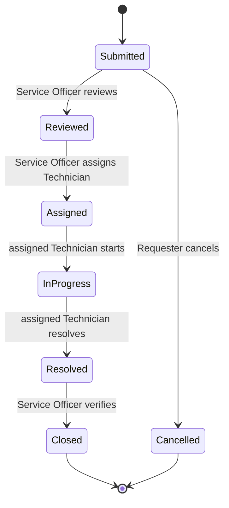

# UML and System Design
**Student:** Obert MOSES — **Student ID:** 221338

The diagrams are written in **Mermaid**, which GitHub draws automatically when you open this file in the repository. To get a picture for Moodle or a Word document, paste each code block into <https://mermaid.live> and use *Actions → PNG*. These diagrams match the final code in `src/`.

## 1. Use case diagram


## 2. Class diagram

`*` after a method name means *abstract-style*: the base class throws an error until a subclass overrides it.

## 3. Sequence diagram — submitting a request


## 4. Sequence diagram — assigning a Technician
```mermaid
sequenceDiagram
  actor Off as Service Officer
  participant App as CampusServiceApp
  participant Mgr as ServiceRequestManager
  participant SR as ServiceRequest
  participant DS as DataStore

  Off->>App: Officer Menu → Assign Technician
  App->>Off: ask officer ID, request ID, technician ID
  Off-->>App: answers
  App->>Mgr: assignTechnician(requestId, officerId, technicianId)
  Mgr->>Mgr: find request (NotFoundError if missing)
  Mgr->>Mgr: requireOfficer(officerId) — canManageRequests()?
  alt not a Service Officer
    Mgr-->>App: PermissionError (audited as Rejected)
    App-->>Off: "ERROR: Only a Service Officer can assign Technicians"
  else officer allowed
    Mgr->>Mgr: find technician user
    Mgr->>SR: assignTechnician(technician, officer)
    SR->>SR: technician.canWorkOnRequests()? status Reviewed → Assigned allowed?
    alt invalid transition or not a Technician
      SR-->>Mgr: WorkflowError / ValidationError (nothing changed)
      Mgr-->>App: error (audited as Rejected)
    else valid
      SR->>SR: set assignedTechnician, transitionTo(Assigned), add history entry
      SR-->>Mgr: request
      Mgr->>Mgr: add audit entry "Technician Assigned"
      Mgr-->>App: request
      App->>DS: saveFrom(manager)
      App-->>Off: "SUCCESS: assigned to <technician>"
    end
  end
```

## 5. Sequence diagram — resolving and closing a request
```mermaid
sequenceDiagram
  actor Tech as Technician
  actor Off as Service Officer
  participant App as CampusServiceApp
  participant Mgr as ServiceRequestManager
  participant SR as ServiceRequest
  participant DS as DataStore

  Tech->>App: Technician Menu → Resolve request
  App->>Mgr: resolveRequest(requestId, technicianId, comment)
  Mgr->>Mgr: requireAssignedTechnician(request, technicianId)
  alt not the assigned Technician
    Mgr-->>App: PermissionError (audited as Rejected)
  else assigned Technician
    Mgr->>SR: transitionTo("Resolved", actor, action, comment)
    SR->>SR: check STATUS_TRANSITIONS (In Progress → Resolved)
    SR->>SR: add history entry
    Mgr->>Mgr: add audit entry "Request Resolved"
    Mgr-->>App: request
    App->>DS: saveFrom(manager)
    App-->>Tech: "SUCCESS: Request is now Resolved"
  end

  Off->>App: Officer Menu → Verify and close
  App->>Mgr: closeRequest(requestId, officerId)
  Mgr->>Mgr: requireOfficer(officerId)
  Mgr->>SR: transitionTo("Closed", officer, ...)
  SR->>SR: check transition (Resolved → Closed), add history entry
  Mgr->>Mgr: add audit entry "Request Closed"
  Mgr-->>App: request
  App->>DS: saveFrom(manager)
  App-->>Off: "SUCCESS: Request is now Closed"
```

## 6. Status workflow (state diagram)

(`InProgress` is shown without a space only because Mermaid state names cannot contain one; the status text in the program is "In Progress".)

## 7. Explanation of the class relationships
- **Inheritance ("is a")**: `StudentRequester`, `StaffRequester`, `ServiceOfficer`, `Technician` and `SystemAdministrator` extend `User`. `ICTSupportRequest`, `MaintenanceRequest`, `CleaningRequest` and `GeneralServiceRequest` extend `ServiceRequest`. The four file repositories extend `FileRepository`.
- **Composition / association ("has a")**: every `ServiceRequest` holds a reference to its requester (a `User`) and, once assigned, to its Technician (a `User`). A request also owns its history array.
- **Aggregation**: `ServiceRequestManager` holds the arrays of users, requests and audit entries.
- **Dependency ("uses")**: `CampusServiceApp` uses the manager, factories, `ReportService` and `DataStore`; it never touches files. The factories create objects; `DataStore` uses the repositories and factories to save and restore data; `ReportService` only reads from the manager.
- **Separation of responsibilities**: menu (`CampusServiceApp`) → rules (`ServiceRequestManager`, `ServiceRequest`) → storage (`DataStore` + repositories).
